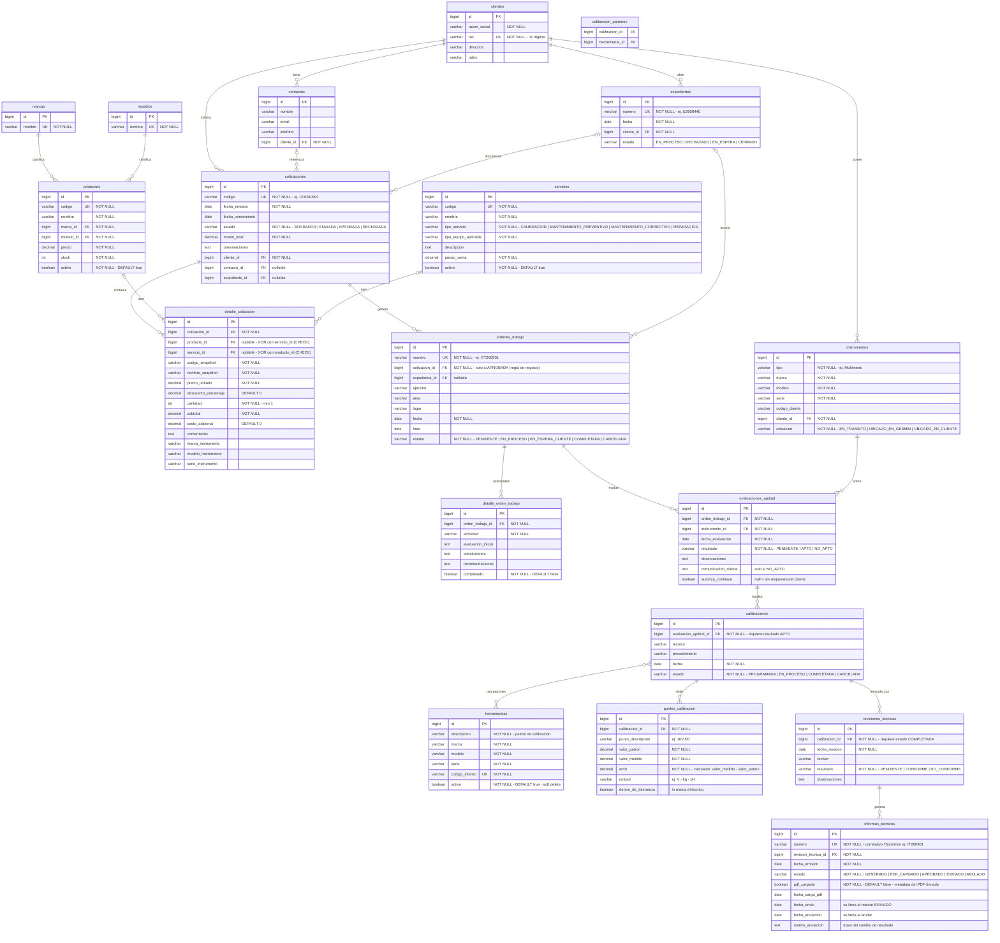

# Gesmin Backend — Modelo de datos (H2)

Diagrama ER generado a partir de las entidades JPA (`src/main/java/com/kevin/backend/model/`). Los nombres de tabla y columna son los reales que Hibernate crea en la BD.

---

## Reglas a nivel de esquema

| Regla | Implementación |
|-------|----------------|
| Detalle de cotización: producto XOR servicio | `CHECK` en tabla `detalle_cotizacion`: exactamente uno de los dos FK debe ser NOT NULL |
| Patrones por calibración (M:N) | Tabla de join `calibracion_patrones` (`calibracion_id`, `herramienta_id`) |
| Puntos de calibración en cascada | `@OneToMany` con `cascade = ALL` + `orphanRemoval`: al re-registrar mediciones se borran y recrean |
| Contactos en cascada | Se crean/borran junto con el cliente (`cascade = ALL` + `orphanRemoval`) |
| Correlativos autogenerados | `expedientes.numero` (E+aa+nnn), `cotizaciones.codigo` (COI+aaMM+nn), `ordenes_trabajo.numero` (OT+aaMM+nn), `informes_tecnicos.numero` (IT+aaMM+nn) |
| Unicidad de negocio | `ruc`, `codigo/codigo_interno/numero` en cada tabla con UK |

## Reglas de negocio que el esquema no puede expresar (viven en los services)

1. Orden de trabajo solo si la cotización está `APROBADA`
2. Calibración solo si la evaluación está `APTO`
3. Revisión solo si la calibración está `COMPLETADA`
4. Revisión `NO_CONFORME` → la calibración vuelve a `EN_PROCESO` (no crea una nueva)
5. Revisión `CONFORME` → genera `informes_tecnicos` automáticamente
6. Patrones (`herramientas`) nunca se borran físicamente: solo `activo = false` (trazabilidad ISO 17025)

## Notas técnicas / para migración futura

- **H2 en archivo** (`jdbc:h2:file:./data/gesmin`, desde el 2026-09-23): los datos persisten entre reinicios. `ddl-auto=update` crea/actualiza las tablas al vuelo. La carpeta `data/` está en `.gitignore` (es estado runtime, no código). Para partir de cero, borrar `data/` con el server detenido.
- **`error` es palabra reservada en PostgreSQL**: la columna `puntos_calibracion.error` funcionará en H2 pero al migrar habrá que renombrar (ej. `error_medido`) o entrecomillar. Valorar desde ya.
- Los enums se guardan como `VARCHAR` (`EnumType.STRING`), no como ordinales: seguro ante reordenamientos.
- `tecnico`, `revisor`, `ejecutor` son texto libre: cuando exista el módulo Usuario deberán pasar a FK.

> El diagrama se renderiza nativamente en GitHub/GitLab y en VS Code con la extensión *Markdown Preview Mermaid Support*. También puede pegarse en [mermaid.live](https://mermaid.live).

---

## Reglas de negocio verificadas en validación (2026-09-23)

> Sesión adversarial completa en [historial E1](HISTORIAL_VALIDACION.md#e1) (125 requests, 13 casos). Resumen histórico de lo que el esquema + services **sí** garantizaban y lo que **quedaba pendiente al 2026-09-23**. El estado actual de H1-H3 figura en [VALIDACION.md](VALIDACION.md).

### Verificadas y funcionando

| Regla | Evidencia |
|-------|-----------|
| OT solo si la cotización está `APROBADA` | 400 con mensaje de guard |
| Calibración solo si la evaluación está `APTO` | 400 con mensaje de guard |
| Revisión solo si la calibración está `COMPLETADA` (PROGRAMADA y EN_PROCESO bloqueados) | 400 con mensaje de guard |
| Evaluación `NO_APTO` → OT a `EN_ESPERA_CLIENTE`; respuesta del cliente crea nueva evaluación o cancela la OT | flujo probado end-to-end |
| Revisión `NO_CONFORME` → calibración vuelve a `EN_PROCESO` (loop sin límite, probado ×3) | mediciones re-registradas y puntos reemplazados por `orphanRemoval` |
| Revisión `CONFORME` → genera `informes_tecnicos` automáticamente con correlativo | `IT260901` auto-generado |
| Correlativos únicos por UK en todas las tablas (`E/COI/OT/IT`) | colisión concurrente bloqueada por UK (ver hallazgo H3) |
| Persistencia en archivo entre reinicios + correlativo continuo (no reinicia en 001) | probado con 3 arranques del server |

### Hallazgos descubiertos el 2026-09-23 (estado histórico)

| # | Hueco | Impacto en datos | Severidad |
|---|-------|------------------|-----------|
| H1 | Re-parchear `CONFORME` sobre una revisión ya resultado genera **otro** informe (no hay guard `existsByRevisionTecnicaId`) | duplicación de certificados | 🔴 ALTA |
| H2 | Sin guard post-`ENVIADO`: una calibración con certificado ya enviado acepta nuevas revisiones CONFORME y re-certifica | re-certificación no deseada | 🔴 ALTA |
| H3 | Correlativo `count()+1` no thread-safe en `generarNumero()` (IT, OT, COI, E) → colisión concurrente = 400 con stacktrace de H2 (el UK evita corrupción, pero el error llega crudo al cliente) | fallo de operación, no corrupción | 🟠 MEDIA |
| H4 | Sin máquina de estados en los PATCH `estado`: se acepta cualquier transición (saltos hacia adelante y regresivos) en cotización, OT, calibración, informe y expediente | estados inconsistentes | 🟠 MEDIA |
| H5 | Cierre de expediente sin validación (OTs incompletas, evaluaciones sin responder, informes sin enviar) + expediente CERRADO reabrible por PATCH | expedientes cerrados con pendientes | 🟡 BAJA |
| H6 | Revisiones simultáneas sobre la misma calibración permitidas; las `PENDIENTE` no reclamadas quedan huérfanas | filas sin uso | 🟡 BAJA |

> Los fixes sugeridos en esa sesión están en [historial E1, sección 3](HISTORIAL_VALIDACION.md#e1); el estado vigente de cada hallazgo está en [VALIDACION.md](VALIDACION.md).

## Archivo firmado fuera de H2 (2026-09-24)

`informes_tecnicos.pdf_cargado` y `fecha_carga_pdf` son metadatos; el PDF firmado real está en `./data/pdf-firmados/{id}.pdf`. Se guarda una sola vez al subirlo por API, y aprobar el informe exige que ese archivo exista. Respaldar la carpeta junto con `gesmin.mv.db`; restaurar solo la base dejaría informes sin su archivo. Cotizaciones, órdenes e informes sin firma se guardan como snapshots en `./data/pdf-generados/` al crear cada registro: `cotizacion-{id}.pdf`, `orden-trabajo-{id}.pdf` e `informe-tecnico-{id}-sin-firma.pdf`. No hay columna nueva: la ruta se deriva de tipo e ID. Si falta el archivo, el GET lo regenera al vuelo sin persistirlo. Respaldar esta carpeta junto con la base y los firmados; un cambio de estado posterior no regenera el snapshot.

## Estado vigente de H1-H3 (actualizado 2026-09-25)

H1 y H2 se controlan en servicios y repositorios sin una nueva restricción de unicidad sobre `revision_tecnica_id`, porque la base de validación previa ya contiene duplicados históricos y `ddl-auto=update` no podría crear esa restricción sin depuración de datos. Se usan bloqueos pesimistas por calibración y comprobaciones de existencia: un informe activo de otra revisión bloquea la emisión, mientras que un informe `ANULADO` permanece en el historial y permite recertificar. H3 usa contador anual bloqueado dentro de la transacción y reintenta la **operación completa** en transacciones nuevas. Las filas históricas duplicadas no se borraron ni se modificaron.

## Respuesta a FreeBuff (2026-09-24)

La primera descripción de H1-H3 (E3) es histórica: [historial E4](HISTORIAL_VALIDACION.md#e4) contiene la refutación y [VALIDACION.md](VALIDACION.md) su estado vigente. El esquema actual agrega `correlativos_contadores(prefijo PRIMARY KEY, ultimo)`. La transacción bloquea la fila anual `E26`/`COI26`/`OT26`/`IT26` hasta confirmar el documento; el contador y su documento se revierten juntos. En un prefijo nuevo, el contador se inicializa con el número de documentos históricos del mismo tipo/año, y el retry cubre la carrera de inserción inicial. No se migraron ni borraron filas previas.

`informes_tecnicos` agrega `fecha_anulacion` y `motivo_anulacion`, además del estado `ANULADO`. Los informes anulados permanecen en el historial y conservan su correlativo, pero no cuentan como vigentes al validar una nueva emisión. Las filas previas con duplicados históricos no fueron corregidas automáticamente.

### Migración del ENUM H2 existente

La base de desarrollo anterior define `INFORMES_TECNICOS.ESTADO` como `ENUM('APROBADO','ENVIADO','GENERADO','PDF_CARGADO')`. `ddl-auto=update` agrega las columnas de anulación, pero no amplía los valores del ENUM. `InformeEstadoSchemaMigration` ejecuta en cada arranque un `ALTER COLUMN` idempotente que incorpora `ANULADO`. Se probó sobre una copia temporal de `data/gesmin.mv.db`; el archivo original no se abrió para escritura.
