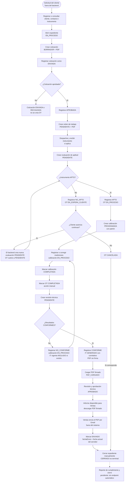

# Flujo de trabajo actual de Gesmin

Estado del backend al 25-set-2026. Este diagrama muestra el recorrido operativo y las decisiones principales; no sustituye la especificación de negocio pendiente de Gesmin.

## Cómo leer los pasos

- La solicitud y el envío por Gmail ocurren fuera del backend. Registrar la cotización como `ENVIADA` tampoco envía un correo automáticamente. Se puede aprobar una cotización directamente desde `BORRADOR` sin pasar por `ENVIADA`.
- El expediente se abre al inicio en este recorrido, aunque `expedienteId` es opcional al crear una cotización. Los PDF de cotización, OT e informe sin firma se generan al crear sus registros y quedan como snapshots.
- `NO_APTO` pone la OT en `EN_ESPERA_CLIENTE`. Si el cliente autoriza continuar, el backend crea otra evaluación; si no, cancela la OT. `NO_CONFORME` reabre la calibración para corregir mediciones y anula el informe vigente, si lo había; una conformidad posterior genera otro correlativo.
- La OT pasa a `COMPLETADA` por una acción manual. El cierre del expediente también es manual y hoy no comprueba estados de OT, evaluaciones ni informes. `CERRADO` no se reabre.
- Ventas descarga el PDF firmado solo cuando el informe está `APROBADO` o `ENVIADO`. Descargarlo no marca el envío. Según la convención provisional de Kevin, Ventas lo remite por Gmail y después marca `ENVIADO`; `fechaEnvio` guarda la fecha de ese PATCH, no una confirmación de entrega. Gesmin aún debe confirmar este procedimiento.
- La carga exige un PDF legible, pero el backend no verifica criptográficamente la firma. El reporte de cumplimiento y cierre aparece con línea discontinua porque hoy no existe un endpoint que lo genere.

Contrato de endpoints y estados: [API.md](API.md). Esquema y persistencia de PDFs: [DB.md](DB.md). Estado de hallazgos: [VALIDACION.md](VALIDACION.md).
